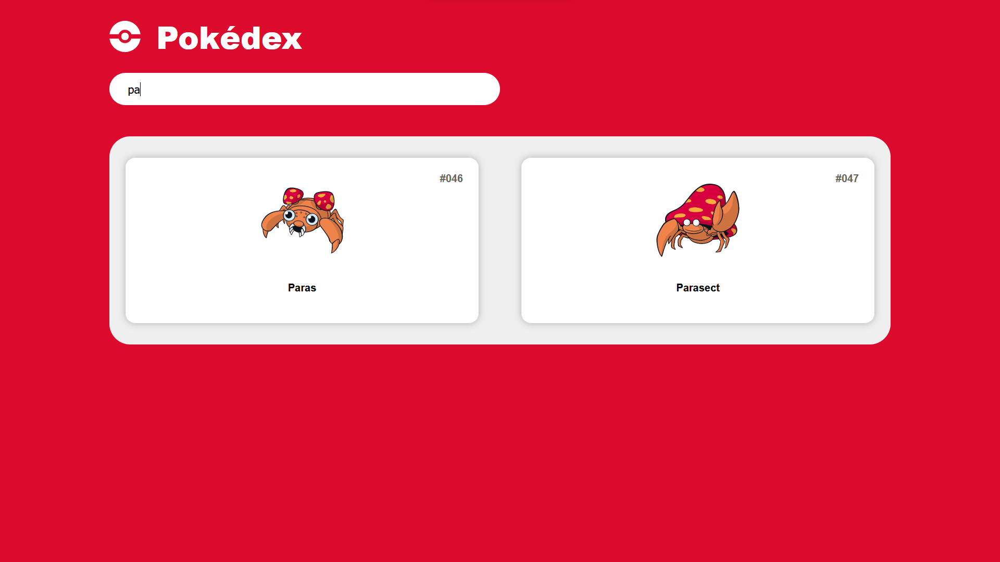

## Pokedex

This project is a Pokedex application inspired by the popular Pokemon series. It fetches data from an external API to deliver comprehensive information about various Pokemon.

### Features

- **Two-page interface:**
  - **Index page:** Displays a list of all Pokemon with individual cards containing:
    - ID
    - Name
    - Image
  - **Details page:** Provides in-depth information about a specific Pokemon:
    - **Header:**
      - Displays Pokemon's ID, name, type(s)
      - Shows Pokemon image
      - Includes navigation arrows for iterating through Pokemon by ID
    - **About section:**
      - Pokemon's weight (kg)
      - Pokemon's height (cm)
      - Pokemon's moves (abilities)
    - **Base Stats section:**
      - Displays the following Pokemon stats with numerical values and visual representation using colored stat bars based on the Pokemon's primary type:
        - HP
        - ATK
        - DEF
        - SATK
        - SDEF
        - SPD

### Technologies Used

- JavaScript (JS)
- HTML
- CSS

### Running the Project

1. Clone or download the project repository.
2. Open the `index.html` file in your web browser.

### Media

#### Index


#### Search-Bar



#### Details


### Project Structure

```
<Pokedex>
  |- index.html  # Main HTML file
  |- details.html # Details HTML file
  |- styles/  # Directory containing stylesheets for the application
    |- pokemon-card.css
    |- pokemon-stats-header.css
    |- pokemon-stats-main.css
    |- reset.css
    |- style.css
    |- typography.css
  |- js/ # Directory containing JavaScript files for the application
    |- pokemon-about.js
    |- pokemon.js
  |- assetsv2/ # Directory containing the assets for the application
    |- arrowPrevious.svg
    |- arrowBack.svg
    |- arrowNext.svg
    |- closeIcon.svg
    |- pokeball.svg
    |- pokemonHeight.svg
    |- pokemonWeight.svg
    |- searchIcon.svg
    |- sortIcon.svg
```
